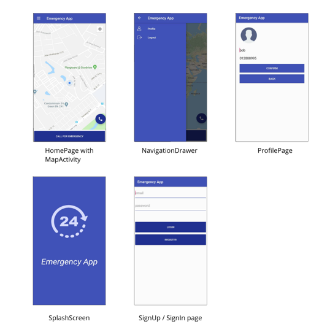

# EmergencyApp 🚑
- an Android app that integrates Microsoft Luis voice recognition technology and Google map to anaylyze user's voice input and deploy the needed emergency help 

## App functions 
- call ambulance via phone number 
- analyze the user's voice input in real time and deploy the requested help 
- show nearby emergency help places (police station, fire station, hospital) 
- Log in and sign up using Firebase 

## App screenshots 

